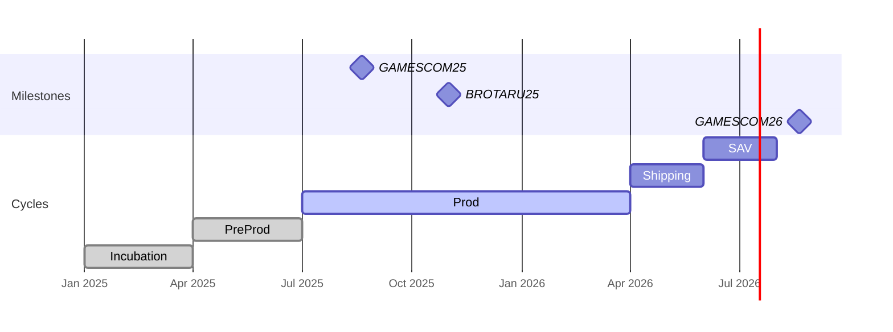

---
tags:
  - game
started: 2025-03-01
ended:
---

# Description

	To Add :
	- GDD Homepage Link ?
	- Wiki Link ?

# Production Plan

#  Loops
```dataviewjs
//yyyy-MM-dd
const currentDate = new Date().toISOString().split('T')[0];
let parentFolder = dv.current().file.folder

// This is the Mermaid configuration.
//---displayMode: compact---
const mermaidConf = `mermaid
  gantt
    dateFormat  YYYY-MM-DD
    axisFormat  %b
    tickInterval 1year
    todaymarker on
`;

const promptCrit = `
  LIST WITHOUT ID 
  
  file.name + " :" + "crit, " + started + ", " + due
  FROM "${parentFolder}" and #loop
  WHERE game
  WHERE !ended
  WHERE due and (due <= date(yesterday))
  SORT started desc
`;

const promptActive = `
  LIST WITHOUT ID 
  
  file.name + " :" + "active, " + started + ", " + due
  FROM "${parentFolder}" and #loop
  WHERE game
  WHERE !ended
  WHERE due and (due > date(yesterday))
  SORT started desc
`;

const promptEnded = `
  LIST WITHOUT ID 
  
  file.name + " :" + "done, " + started + ", " + ended
  FROM "${parentFolder}" and #loop
  WHERE game
  WHERE ended
  SORT started desc
`;
// Query data and process output for active items
const queryResultCrit = await dv.queryMarkdown(promptCrit);
const formattedListCrit = queryResultCrit.value.replace(/^-\s/gm, "");

// Query data and process output for active items
const queryResultActive = await dv.queryMarkdown(promptActive);
const formattedListActive = queryResultActive.value.replace(/^-\s/gm, "");

// Query data and process output for ended items
const queryResultEnded = await dv.queryMarkdown(promptEnded);
const formattedListEnded = queryResultEnded.value.replace(/^-\s/gm, "");

// Generate and write Mermaid Gantt Chart
const chartMarkup = `
  \`\`\`${mermaidConf}
  section Milestones
  BROTARU : milestone, 2025-10-01, 0d
  section Loops
  ${formattedListCrit}
  ${formattedListActive}
  ${formattedListEnded}
  \`\`\`
`;

dv.paragraph(chartMarkup);
```
#### Loops : 
```base
filters:
  and:
    - file.hasLink(this.file)
    - "!game.isEmpty()"
formulas:
  Game: link(loop).asFile()
  Author: authors
properties:
  formula.Game:
    displayName: Loop
views:
  - type: table
    name: Table
    order:
      - file.name
    sort:
      - property: started
        direction: DESC
    columnSize:
      formula.Author: 137

```
```button
name New Loop
id newLoop
```


